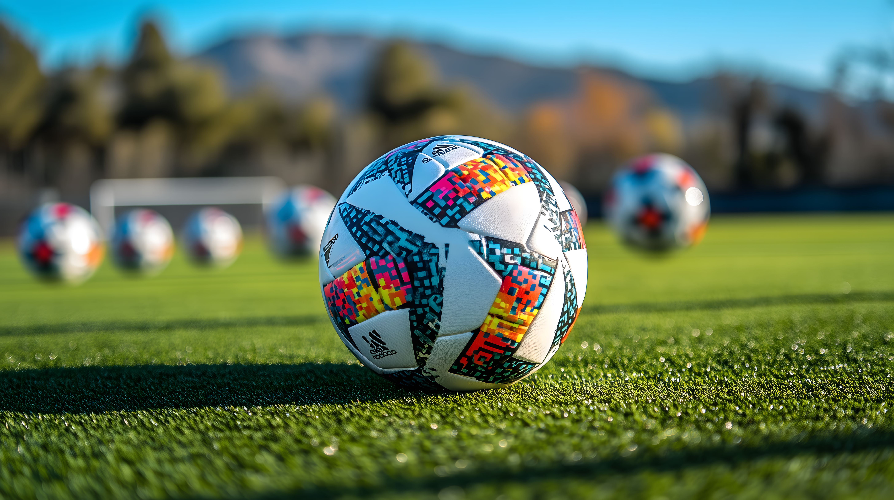

# Übung: Hobby-Galerie mit HTML und CSS

## Lernziele

- Verwendung von HTML-Links (`<a>`) zur Navigation und Verlinkung
- Einbindung von Bildern mit dem ``-Tag
- Arbeiten mit CSS-Klassen zur Gestaltung
- Grundlagen des CSS Flexbox-Layouts

## Neue Konzepte

### 1. HTML-Links mit `<a>`

- Links sind Verweise auf andere Webseiten oder Dateien
- Syntax: `<a href="ziel">Linktext</a>`
- Beispiele:

  ```html
  <!-- Link zu einer anderen Seite im Projekt -->
  <a href="hobby.html">Meine Hobbies</a>

  <!-- Link zu einer externen Webseite -->
  <a href="https://dfb.de">Zum DFB</a>
  ```

### 2. Bilder mit ``

- Dient zur Einbindung von Bildern
- Wichtige Attribute:
  - `src`: Pfad zur Bilddatei
  - `alt`: Alternativtext für Barrierefreiheit
  - `width`: Breite des Bildes
- Beispiel:
  ```html
  
  ```

### 3. CSS-Klassen

- Klassen sind wiederverwendbare Stilregeln
- Werden mit einem Punkt (.) definiert
- Zuweisung im HTML mit `class="klassenname"`
- Mehrere Klassen möglich: `class="klasse1 klasse2"`

### 4. Neue CSS-Eigenschaften

#### Flex-Container (`.hobbies`)

```css
.hobbies {
  /* Aktiviert Flexbox-Layout */
  display: flex;

  /* Verteilt Elemente gleichmäßig */
  justify-content: space-around;

  /* Erlaubt Umbruch in neue Zeilen */
  flex-wrap: wrap;

  /* Entfernt Standard-Formatierung */
  background-color: darkred;
  margin: 0px;
  padding: 0px;
  border: 0px;
}
```

#### Bild-Container (`.hobby`)

```css
.hobby {
  /* Legt Breite fest */
  width: 600px;

  /* Ermöglicht horizontale Anordnung */
  display: inline-block;
}
```

## Aufgaben

### 1. Links und Navigation

1. Erstelle einen Link zur Hobby-Seite in der `index.html`:
   ```html
   <p><a href="hobby.html">Meine Hobbies</a></p>
   ```

### 2. Bilder einbinden

1. Füge ein verlinktes Bild ein:
   ```html
   <a href="https://dfb.de">
     
   </a>
   ```

### 3. Galerie erstellen

1. Erstelle die Grundstruktur mit CSS-Klassen:

   ```html
   <div class="hobbies">
     <div class="hobby">
       <!-- Hier kommen die verlinkten Bilder rein -->
     </div>
   </div>
   ```

2. Füge vier Bilder in die Galerie ein (abwechselnd Fußball/Basketball)

## Praxistipps

- Überprüfe die Links durch Klicken
- Teste, ob die Bilder korrekt angezeigt werden
- Verändere die Browserbreite, um das responsive Verhalten zu testen
- Prüfe die Alt-Texte durch Deaktivieren der Bilder

## Übungskontrolle

- [ ] Alle Links funktionieren
- [ ] Bilder werden korrekt angezeigt
- [ ] Galerie passt sich der Bildschirmbreite an
- [ ] CSS-Klassen sind korrekt zugewiesen
- [ ] Flexbox-Layout verteilt die Bilder gleichmäßig

## Quellen:

fussball.jpg von Marco Verch: https://ccnull.de/foto/fussball-auf-gruenem-spielfeld-mit-weiteren-baellen-im-hintergrund/1106229

basketball.jpg von pexels: https://pixabay.com/photos/man-ball-basketball-person-sport-1837119/
